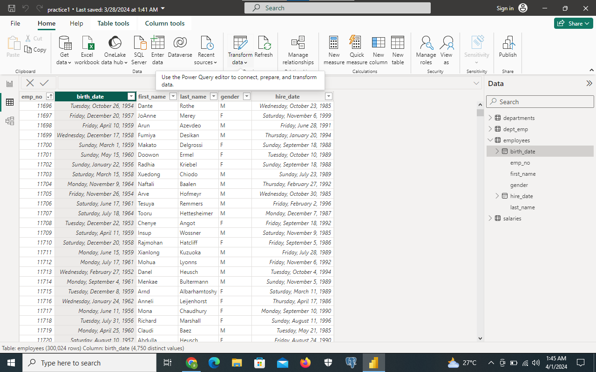
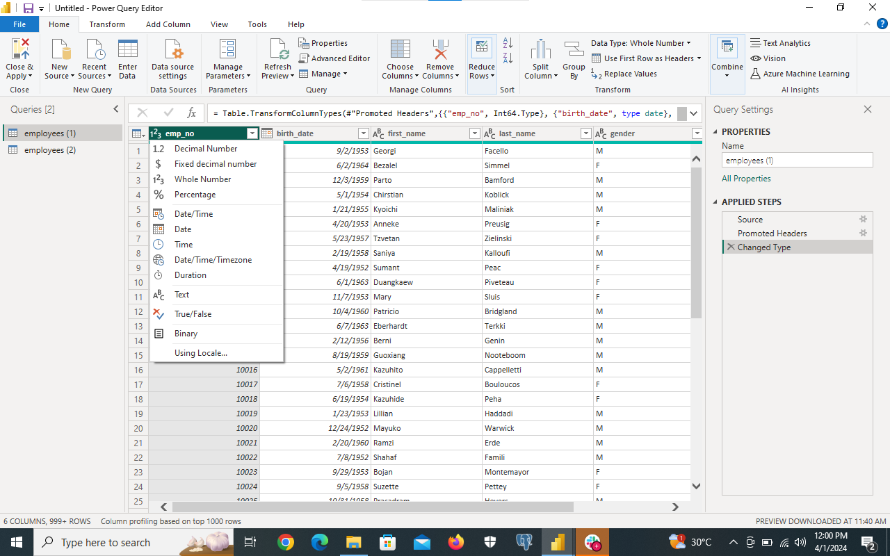
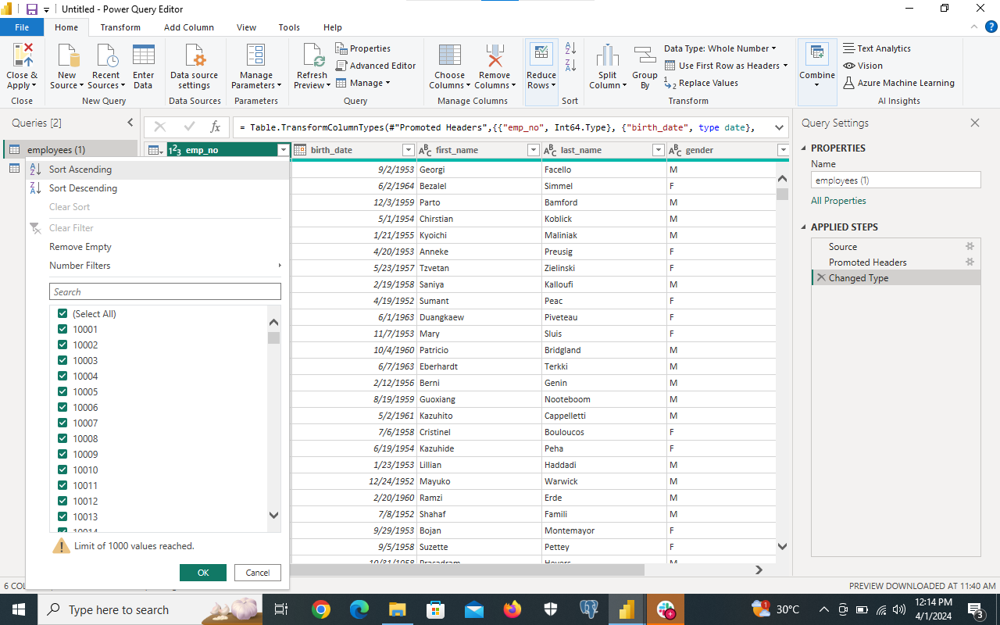
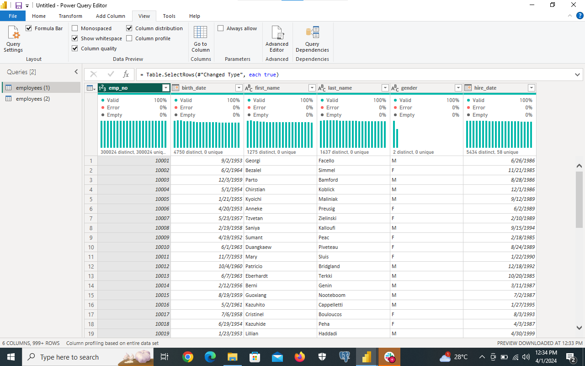
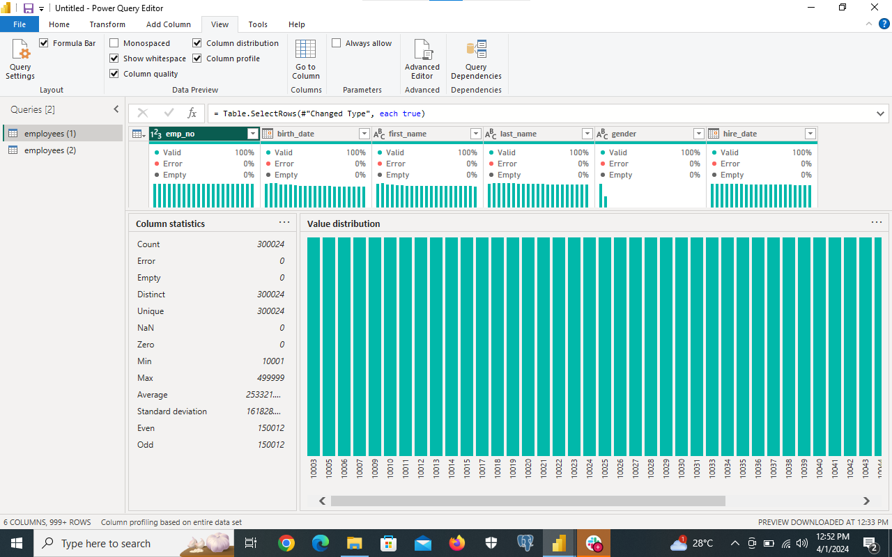
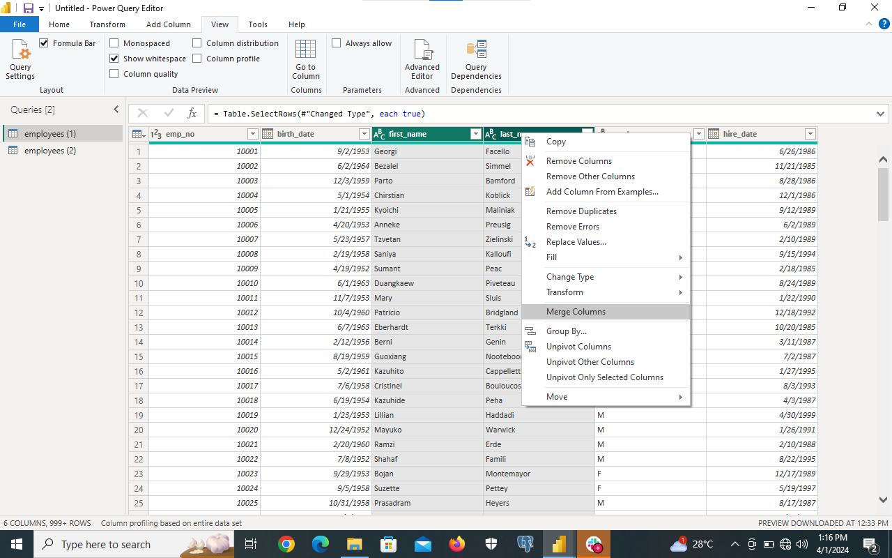
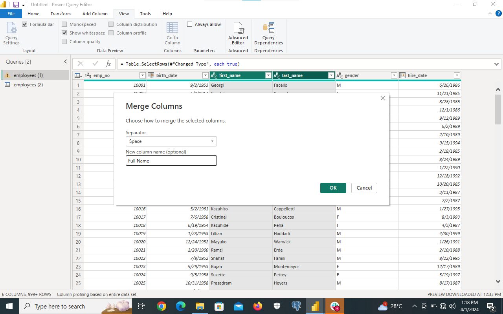
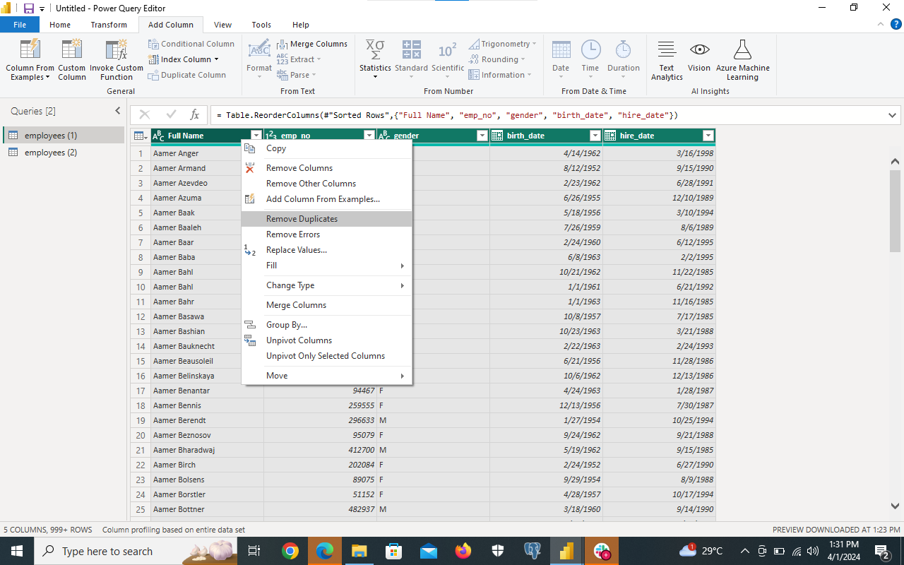
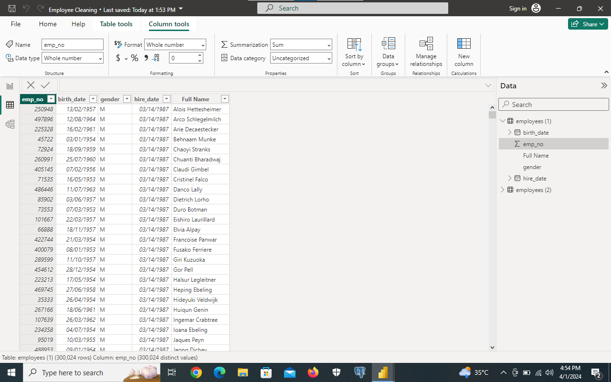

# Data_Cleaning_Using_PowerBI
# Introduction
This is a data cleaning project using PowerBI. The Dataset provides information about the employees in s company. It includes the employees name, their hired date, thier date of bath and thier gender. This documents includes the various steps I took in cleaning the data.

# The Goals of the Project
The Goal of the project is to explore the various data cleaning steps in PowerBI.
Here is a picture of the dirty data 

# Tools Used
1) Power BI Desktop
2) Power Query

## Step 1; Load the data to Power Query by clicking on Transfrorm Data in Power Query Desktop, here your data would be viewed in Power Query and ready for cleaning.

## Step 2; On the emp_no coloumn, click on the filter and sort in asceding order of emp_no

## Step 3; Click on the data type icon on all coloum to check and verify the data types
## Step 4; On the view tab, Check Coloumn quality and Coloumn Distribution to previw the coloumn.
The emp_no coloumn had 3000024 distincts values and 3000024 unique values. This means the every value in that table is uniquely defined and not repeated which is also the primary key.

The birthdate coloumn had 4750 distinct values but 0 unique values. This means that more than one person has the same birthdate. 

The first Name coloumn wew had 1275 distinct values and 0 unique values. This means more than one individual bear the same first name.

The Last Name column we had 1637 distinct values and 0 unique values. This means more than one indivivdual bear the same last Name.

The Gender Coloumn, we had 2 distinct values and 0 unique values . This shows that more than one indivual is either male or female.

The coloumn Quality shows the number of erros or null values in a coloumn and there were no coloumn without values.

## Step 5; check Coloumn. The coloumn Profile shows the overall information of a coloumn.

## Step 6; Merge the First Name and Last Name Coloumn and Name it the full Name Coloumn
Click the first name coloumn, control hold and select the last coloumn, Right Click and then click on Merge Coloumn.

Select the Delimitter(In this case its Space), Type out the  name of the new coloumn( In this Case its First Name).

## Step 7; Select the whole Data and Check for Duplicates. Control A> Right Click > Click Remove Duplicates.

## Close and apply to save changes

Here you have your data set

